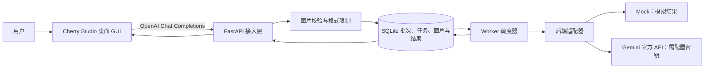

# 图片内容真实性批量核验系统

这是一个单机图片核验后端，负责接收图片、持久化批次和任务、调度模型调用、保存结果并支持查询与恢复。桌面操作界面复用 Cherry Studio；项目只实现 Cherry Studio 需要的 OpenAI 兼容接口，不另造一套完整前端。

## 项目当前状态

- 默认后端是 Mock。它固定返回 `uncertain` 并标记 `simulated: true`，只用于验证软件流程，**不判断图片真假**。
- `gemini` 官方 API 适配器与 `web` 网关适配器均已实现；两者都还没有用真实凭证联调，也没有真实图片质量验收或成本验证。
- Cherry Studio 已通过本机真实界面的双图、单图和 `/status` 验收；这些请求使用的是 Mock。SSE 和有效取消命令由接口测试覆盖，Cherry Studio 内对应的交互展示尚未全部验收。
- 后端可选 `mock`、`gemini`（官方 API）或 `web`（本地网关，前置会话池与出口池）。`web` 后端把资源池管理交给网关，本服务只负责协议转换、错误映射与结果校验。三种接入方式互不相同，网页账号登录与 Gemini API Key 不可互换。

## 系统组成



一条图片任务的处理过程是：客户端上传图片 → 服务验证文件 → SQLite 在一个事务中保存图片、批次和任务 → Worker 按并发与配额领取任务 → 后端返回结构化判定 → 服务校验结果并保存 → Cherry Studio 显示结果。任务状态保存在本地数据库中，因此聊天窗口断开后仍可查询已接受的批次。

## 主要功能

| 功能 | 说明 |
|---|---|
| Cherry Studio 接入 | 提供 `/v1/models` 和 `/v1/chat/completions`；支持文本、单图、多图及 SSE 流式响应。 |
| 批量图片处理 | 默认每次最多 20 张 JPEG、PNG 或 WebP 图片；逐张建立任务并汇总为批次。 |
| 输入保护 | 实际解码图片，检查格式、大小、像素和截断问题；不下载远程图片 URL。 |
| 持久化任务队列 | SQLite WAL 保存图片、批次、任务、尝试历史和结果。 |
| 调度与限额 | 有界队列、并发限制、分钟/小时预算、平滑调用间隔、截止时间和有界重试。 |
| 故障恢复 | 服务重启后继续处理排队任务；无法确认上游是否执行的任务标记为未知，不盲目重复调用。 |
| 去重与缓存 | 按图片内容和后端配置签名去重；成功结果在缓存期内可复用。 |
| 查询与取消 | 可查询批次和任务；支持取消单个任务，并防止晚到结果覆盖已取消状态。 |
| 运维 | 提供健康检查、统计、SQLite 备份、旧批次清理预览与应用、暂停/恢复和离线重配置命令。 |

判定值为 `yes`、`no`、`uncertain` 之一，并带简短理由。业务上的“不确定”与技术失败分开记录。取消表示本地任务不再接收结果；如果上游调用已经开始，不能保证远端推理也被停止。

## 目录结构

```text
image-verifier/
├── src/image_verifier/       # Python 应用源代码
├── scripts/                  # Windows 启动、接入、提交、验证脚本
├── tests/                    # 单元测试、接口测试和 Cherry SDK 契约测试
├── docs/                     # 技术方案、架构和运维说明
├── work/                     # 自动生成的测试数据库、样例和日志；不作为源代码
├── pyproject.toml            # Python 项目与依赖声明
├── uv.lock                   # Python 依赖精确锁定
├── .env.example              # 配置模板；复制为本地 .env 后填写
├── task_plan.md              # 阶段计划与验收状态
├── findings.md               # 研究发现和技术决策
├── progress.md               # 开发与测试进度记录
└── HANDOFF.md                # 项目交接入口
```

### 源码模块

| 文件 | 职责 |
|---|---|
| `api.py` | 创建 FastAPI 应用；提供健康检查、批次/任务/管理接口；启动并关闭 Worker。 |
| `chat.py` | Cherry Studio 兼容层；发现模型、解析 OpenAI 格式文本和内嵌图片、处理 `/status` 等聊天命令并生成普通或 SSE 响应。 |
| `store.py` | SQLite 数据层；定义表结构并实现事务、批次提交、任务领取、租约、配额、缓存、取消、备份和清理。 |
| `worker.py` | 后台调度；领取任务、加载图片、执行模型、更新心跳，并按任务状态保存成功或失败。 |
| `backends.py` | 后端抽象和实现；包含只返回模拟值的 Mock，以及调用 Gemini `generateContent` 的适配器。 |
| `images.py` | 图片解码、格式/大小/像素/完整性验证和内容哈希。 |
| `models.py` | 判定结果、图片输入及服务/后端错误的数据结构。 |
| `config.py` | 环境变量、模型/提示模板签名、资源预算和配置约束。 |
| `cli.py` | 命令行入口：`serve`、`worker`、`backup`、`prune` 和 `reconfigure`。 |

### 脚本与测试

- `scripts/start.ps1`：加载项目根目录 `.env`（若存在）并启动服务。
- `scripts/connect-cherry.ps1`：通过 Cherry Studio 官方导入协议添加本地 OpenAI 兼容服务商。
- `scripts/submit.ps1`：使用 HTTP multipart 接口提交一组图片。
- `scripts/check.ps1`：运行 Ruff、pytest 和 Mock HTTP 重启恢复冒烟检查。
- `scripts/smoke.py`：启动隔离的本地 Mock 服务，验证任务提交、进程重启恢复和缓存行为；可选运行 Cherry SDK 契约测试。
- `tests/test_api.py`：HTTP 接口、鉴权、提交和取消测试。
- `tests/test_chat.py`：Cherry Chat Completions、图片、命令、SSE 和兼容性测试。
- `tests/test_store.py`：SQLite 事务、幂等、队列、配额、缓存、租约和取消测试。
- `tests/test_worker.py`：Worker 执行、重试、异常和晚到结果隔离测试。
- `tests/test_backends.py`：后端响应解析和错误分类测试，使用模拟 HTTP 响应，不调用真实 Gemini。
- `tests/cherry_sdk/`：锁定 Cherry Studio v2.1.2 所用 SDK 版本的兼容契约测试。

## 本机运行

要求 Windows PowerShell 7、Python 3.11 或以上，以及 `uv`。

在项目根目录启动默认 Mock 服务：

```powershell
# 在仓库根目录执行
cd app
pwsh -File scripts\start.ps1
```

也可以直接运行：

```powershell
uv sync --frozen
uv run --frozen image-verifier serve
```

服务默认只监听本机 `127.0.0.1:8083`。启动后可打开 [Swagger 接口文档](http://127.0.0.1:8083/docs)、[存活检查](http://127.0.0.1:8083/health/live) 和 [就绪检查](http://127.0.0.1:8083/health/ready)。前台窗口按 Ctrl+C 停止。

## 使用 Cherry Studio

1. 启动本地服务，并确认 `/health/live` 返回 `status=ok`。
2. 另开 PowerShell，在项目目录运行 `pwsh -File scripts\connect-cherry.ps1`。
3. 在 Cherry Studio 保存导入的本地服务商，类型选择 OpenAI Chat Completions，点击同步模型并添加 `image-verifier-vision`。
4. 在模型输入模态中开启视觉，然后在 Cherry Studio 对话里选择此模型并发送文本或上传图片。

可在 Cherry Studio 中发送以下命令：

| 命令 | 用途 |
|---|---|
| `/batches` | 列出最近批次及完成数量。 |
| `/status <批次ID>` | 查看批次进度和各图片结果。尖括号是占位说明，发送时替换成真实 ID。 |
| `/cancel <任务ID>` | 取消一个任务；参数必须替换成真实任务 ID。 |
| `/stats` | 查看本地队列和调度统计。 |

首次可以用 `work/cherry-gui-samples/sample-a.png` 和 `sample-b.png` 做无敏感测试。Mock 的回复会出现“模拟结果”，只能验证软件链路，不能作为图片真伪判断。

## HTTP 批量接口

用脚本提交 JPEG/PNG/WebP 图片：

```powershell
./scripts/submit.ps1 -Images 'D:\图片\样例1.png','D:\图片\样例2.jpg'
```

脚本会打印 `batch_id`、`task_ids` 和 `status_url`。也可以直接查询：

```powershell
Invoke-RestMethod 'http://127.0.0.1:8083/v1/batches/替换为batch_id' |
    ConvertTo-Json -Depth 10
```

| 方法 | 路径 | 用途 |
|---|---|---|
| `GET` | `/health/live` | 检查服务进程是否运行。 |
| `GET` | `/health/ready` | 检查数据库、调度资源与近期 Worker 心跳。 |
| `GET` | `/v1/models` | Cherry Studio 模型发现。 |
| `POST` | `/v1/chat/completions` | OpenAI 兼容聊天、图片提交、命令查询和 SSE。 |
| `POST` | `/v1/batches` | 以 multipart 形式提交批次。 |
| `GET` | `/v1/batches/{batch_id}` | 查询批次及其中所有任务。 |
| `GET` | `/v1/tasks/{task_id}` | 查询单任务及尝试历史。 |
| `POST` | `/v1/tasks/{task_id}/cancel` | 取消单个任务。 |
| `GET` | `/v1/metrics` | 查询运行指标。 |
| `PUT` | `/admin/resource` | 管理员暂停或恢复后端调度。 |

## 配置真实后端

两种真实后端都通过同一个适配接口接入，区别只在容量从哪来。

- `gemini` 适配器调用官方 `generateContent` 图片接口，要求模型输出符合 JSON Schema 的判定结果。
- `web` 适配器把图片以 base64 内联发送给本地网关的 OpenAI 兼容接口。会话池、出口绑定、上游节奏与保活由网关负责，本服务不直接接触会话凭证，也不自行管理身份。

切换任一真实后端都会把图片发送给对应的上游服务；请先确认隐私、配额与费用要求。

### 使用官方 API 后端

1. 复制 `.env.example` 为 `.env`，保留 `IV_HOST=127.0.0.1`，设置 `IV_BACKEND=gemini`、经验证的 `IV_MODEL` 和 `GEMINI_API_KEY`。
2. 按自己的配额设置 `IV_RPM`、`IV_RPH`、`IV_CONCURRENCY`；模板值只是演示配置，不代表上游保证的额度。
3. 停止当前服务，再运行 `pwsh -File scripts\start.ps1`，让程序从 `.env` 读取配置。
4. 使用无敏感图片做真实后端联调，检查实际返回模型、错误、延迟、配额和结果质量。

### 使用本地网关后端

1. 先在另一端口启动网关（默认规划为 `8084`，避免与本服务的 `8083` 冲突），并按网关自己的管理面板完成资源池配置。
2. 在 `.env` 中设置 `IV_BACKEND=web`、`IV_WEB_BASE_URL`（形如 `http://127.0.0.1:8084/v1`）、网关的密钥（如有）、以及经验证的 `IV_MODEL`。
3. `IV_RPM` / `IV_RPH` 是本服务的**外层**预算。网关对其资源池还有一层自己的限速，两者不要叠加超配：本地预算应设在网关能稳定服务的水平以下。
4. 网关不可用时，适配器按 `connection_failed` 处理并重试；网关返回鉴权错误会暂停调度，需要人工诊断后恢复。

不要把密钥提交到版本库或发到聊天中。`.env` 已加入 `.gitignore`。切换到真实后端前应备份数据；若修改同一数据库的模型或预算设置，要先停止所有进程、排空或取消待处理任务，再按运维说明执行离线 `reconfigure`。隔离试验可为 `IV_DB_PATH` 指定新的数据库路径。

缺少必需的凭证、网关地址或有效模型时，服务会拒绝以对应真实模式启动。没有真实联调记录前，不应把任何真实后端描述为已验收。

## 数据、隐私与安全边界

- 默认数据库为当前工作目录下的 SQLite 文件；数据库内会保存已提交图片的字节、批次、任务、判定和尝试元数据。`.gitignore` 排除了常见数据库和 `work/` 文件，但正式数据仍需自行备份与清理。
- 只接受直接上传的图片或 Cherry Studio 发送的内嵌图片；不会抓取任意远程 URL 或本地路径。
- 默认监听回环地址，不提供多租户或用户级权限隔离。若要从其他机器访问，必须配置业务鉴权并规划 TLS 与密钥管理，不能直接暴露未鉴权端口。
- 使用 `web` 后端时，会话凭证与资源池都在网关侧管理，本服务的数据库中不保存这类凭证。`gemini` 后端使用 API Key，与网页账号登录不可互换。
- `/health/ready` 只检查本地调度依赖，不代表上游模型在线或图片判定质量合格。

## 配置项

配置通过环境变量传入。除 `GEMINI_API_KEY` 外，变量使用 `IV_` 前缀。

| 变量 | 默认值 | 说明 |
|---|---:|---|
| `IV_BACKEND` | `mock` | `mock`、`gemini` 或 `web`。 |
| `IV_MODEL` | `mock-v1` | 后端模型 ID；真实模型必须先验证兼容性。 |
| `GEMINI_API_KEY` | 空 | 仅 `gemini` 后端需要。 |
| `IV_WEB_BASE_URL` | `http://127.0.0.1:8084/v1` | 仅 `web` 后端需要；网关的 OpenAI 兼容根地址。 |
| `IV_WEB_API_KEY` | 空 | 仅 `web` 后端需要；网关 Bearer 密钥，留空则不发送鉴权头。 |
| `IV_DB_PATH` | `data/verifier.sqlite3` | SQLite 数据库路径。 |
| `IV_HOST` / `IV_PORT` | `127.0.0.1` / `8083` | HTTP 监听地址和端口。 |
| `IV_API_KEY` | 空 | 业务 API Bearer 令牌；Cherry Studio 配置的密钥需与它相同。 |
| `IV_ADMIN_KEY` | 空 | 管理 API 独立令牌，应与业务令牌不同。 |
| `IV_WORKERS` / `IV_CONCURRENCY` | `2` / `2` | Worker 循环数与全局并发租约上限。 |
| `IV_RPM` / `IV_RPH` | `60` / `600` | 单资源预算域的分钟和小时请求上限。 |
| `IV_MAX_PENDING` | `1000` | 等待中及运行中任务数量上限。 |
| `IV_MAX_ATTEMPTS` | `2` | 每任务最大总尝试数。 |
| `IV_ATTEMPT_TIMEOUT` | `20` 秒 | 单次上游调用超时。 |
| `IV_MAX_BATCH` | `20` | 单个批次图片数上限。 |
| `IV_MAX_IMAGE_BYTES` | `5 MiB` | 单张图片字节上限。 |
| `IV_MAX_PIXELS` | `20,000,000` | 单张图片像素上限。 |

## 开发与验证

```powershell
pwsh -File scripts\check.ps1
uv run python scripts\smoke.py --cherry-sdk
```

自动测试使用 Mock 或模拟 HTTP 响应，不会验证真实模型准确率，也不会调用计费 API。完整架构和运维细节见 [架构说明](docs/architecture.md)、[运维说明](docs/operations.md) 与 [技术方案优化稿](docs/技术方案优化稿-v2.md)。阶段进度见 [task_plan.md](task_plan.md) 和 [progress.md](progress.md)。
